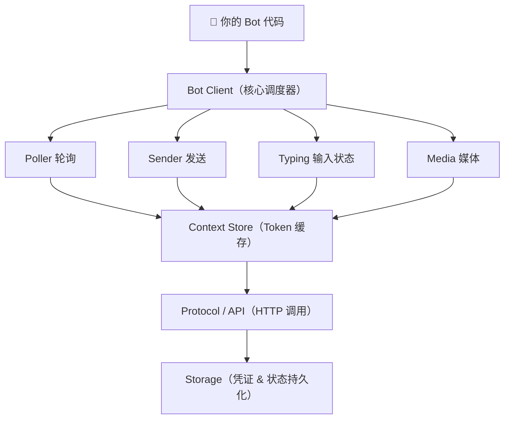

# WeChatBot

<p align="center">
  <strong>微信 iLink Bot SDK — 让任何 AI Agent 接入微信</strong><br/>
  <sub>模块化 · 生产级 · 多语言（Node.js / Python / Go / Rust）</sub>
</p>

<p align="center">
  <a href="https://www.npmjs.com/package/@wechatbot/wechatbot"></a>
  <a href="https://pypi.org/project/wechatbot-sdk/"></a>
  <a href="https://crates.io/crates/wechatbot"></a>
  <a href="https://github.com/xiaolitongxue666/wechatbot/blob/main/LICENSE"></a>
  <a href="https://github.com/xiaolitongxue666/wechatbot"></a>
</p>

---

[English](README.EN.MD)

**5 分钟让任何 Agent 接入微信。** 灵感来自 [openclaw-weixin-cli](https://github.com/nicepkg/openclaw-weixin)。

WeChatBot 是一套完整的微信 iLink Bot 开发工具包，提供 **4 种语言** 的 SDK，统一 API 设计，覆盖从简单 Echo Bot 到企业级多 Bot 编排的全部场景。

---

## 📦 SDK 一览

| SDK | 安装 | 语言 | 运行时 | 外部依赖 | 状态 |
|-----|------|------|--------|----------|------|
| [Node.js](nodejs/) | `npm install @wechatbot/wechatbot` | TypeScript | Node ≥ 22 | 0 运行时依赖 | ✅ 生产就绪 |
| [Python](python/) | `pip install wechatbot-sdk` | Python ≥ 3.9 | asyncio | aiohttp, cryptography | ✅ 生产就绪 |
| [Go](golang/) | `go get github.com/xiaolitongxue666/wechatbot/golang` | Go 1.22+ | goroutines | 纯标准库，零依赖 | ✅ 生产就绪 |
| [Rust](rust/) | `cargo add wechatbot` | Rust 2021 | tokio | reqwest, serde, aes, tokio… | ✅ 生产就绪 |

---

## ⚡ 快速开始

### Node.js

```typescript
import { WeChatBot } from '@wechatbot/wechatbot'

const bot = new WeChatBot()

// 配置（可选，以下均为默认值）
// const bot = new WeChatBot({
//   storage: 'file',            // 'file' | 'memory' | 自定义 Storage
//   storageDir: '~/.wechatbot',
//   logLevel: 'info',           // 'debug' | 'info' | 'warn' | 'error' | 'silent'
//   loginCallbacks: {
//     onQrUrl: (url) => renderQr(url),
//     onScanned: () => console.log('已扫码!'),
//   },
// })

await bot.login()                             // 扫码登录（已有凭证则跳过）
bot.onMessage(async (msg) => {
  await bot.sendTyping(msg.userId)            // 显示"对方正在输入中..."
  await bot.reply(msg, `Echo: ${msg.text}`)   // 自动回复
})
await bot.start()
```

### Python

```python
from wechatbot import WeChatBot

bot = WeChatBot()

# 配置（可选）
# bot = WeChatBot(
#     base_url="https://ilinkai.weixin.qq.com",
#     cred_path="~/.wechatbot/credentials.json",
#     on_qr_url=lambda url: print(f"扫码: {url}"),
#     on_error=lambda err: print(f"错误: {err}"),
# )


@bot.on_message
async def handle(msg):
    await bot.send_typing(msg.user_id)
    await bot.reply(msg, f"Echo: {msg.text}")


bot.run()  # 扫码登录 + 开始监听
```

### Go

```go
package main

import (
    "context"
    "fmt"
    wechatbot "github.com/xiaolitongxue666/wechatbot/golang"
)

func main() {
    ctx := context.Background()
    bot := wechatbot.New()

    // 配置（可选）
    // bot := wechatbot.New(wechatbot.Options{
    //     OnQRURL: func(url string) { fmt.Println("扫码:", url) },
    //     OnError: func(err error) { fmt.Println("错误:", err) },
    // })

    creds, _ := bot.Login(ctx, false)
    fmt.Printf("已登录: %s\n", creds.AccountID)

    bot.OnMessage(func(msg *wechatbot.IncomingMessage) {
        bot.SendTyping(ctx, msg.UserID)
        bot.Reply(ctx, msg, fmt.Sprintf("Echo: %s", msg.Text))
    })

    bot.Run(ctx)
}
```

### Rust

```rust
use wechatbot::{WeChatBot, BotOptions};

#[tokio::main]
async fn main() -> Result<(), Box<dyn std::error::Error>> {
    let bot = WeChatBot::new(BotOptions::default());

    // 配置（可选）
    // let bot = WeChatBot::new(BotOptions {
    //     on_qr_url: Some(Box::new(|url| println!("扫码: {}", url))),
    //     on_error: Some(Box::new(|err| eprintln!("错误: {}", err))),
    //     ..Default::default()
    // });

    bot.login(false).await?;
    bot.on_message(Box::new(|msg| {
        println!("{}: {}", msg.user_id, msg.text);
    })).await;
    bot.run().await?;
    Ok(())
}
```

---

## ✨ 核心功能

所有 SDK 共享以下能力：

| 功能 | 说明 |
|------|------|
| 🔐 扫码登录 | 二维码登录，凭证持久化存储于 `~/.wechatbot/`，下次启动自动复用 |
| 📨 长轮询消息 | 35s 服务端长连接，自动游标管理，支持任意数量并发消息 |
| 💬 富媒体收发 | 文本、图片、语音、视频、文件 — 统一上传 + 下载 + CDN 加密 |
| 🔗 context_token | 自动提取、缓存、注入，跨重启持久化，会话路由准确无误 |
| ⌨️ 输入状态 | "对方正在输入中..." 指示器，ticket 自动获取并缓存 24h |
| 🔒 CDN 加密 | AES-128-ECB 加密上传/下载，三格式密钥自动识别 |
| ♻️ 会话恢复 | 会话过期（errcode: -14）自动清除状态、重新登录、恢复轮询 |
| 📝 智能分片 | 2000 字按自然边界拆分：段落 → 换行 → 空格 → 硬切，每片独立 client_id |
| 🌐 网络容错 | 指数退避重试（1s → 10s max），连接断开自动恢复 |

### Node.js 独有功能

| 功能 | 说明 |
|------|------|
| 🧩 中间件管道 | Express/Koa 风格可组合中间件，内置日志、限流、类型过滤、正则过滤 |
| 📦 可插拔存储 | 文件、内存或自定义（Redis、SQLite…），实现 `Storage` 接口即可 |
| 🎯 类型化事件 | `login` / `message` / `session:expired` / `session:restored` / `error` / `poll:start` / `poll:stop` / `close` |
| 📝 结构化日志 | 分级（debug/info/warn/error）、上下文感知、可插拔传输 |
| 🏗️ 消息构建器 | `.text(msg).image(buf).file(data, 'report.pdf').build()` 链式 API |
| 🔗 URL 自动下载 | `{ url: 'https://…' }` → 自动下载并检测类型后发送 |
| 🗣️ 语音转码 | SILK → WAV（可选 `silk-wasm` 依赖） |
| ✂️ Markdown 剥离 | `stripMarkdown()` 清洗 AI 模型输出后再发送 |

### Rust 高级功能

Rust SDK 提供了远超基础 Bot 功能的企业级能力栈：

| 功能 | 说明 |
|------|------|
| 🖥️ 管理后台 | 基于 Axum + Askama 的 Web UI：Bot 概览、列表、详情、对话历史、JSON API |
| 🔀 多 Bot 编排 | `BotSessionManager` 管理多个 Bot 会话并发运行 |
| 📊 事件管线 | `MessageIngestor` 消息规范化 → 持久化 → 队列派发 |
| 🚀 异步转发 | `ForwarderWorker` HMAC 签名异步 webhook 转发，支持重试 |
| 🗄️ 持久化存储 | PostgreSQL（sqlx）消息存储 + Redis 会话状态 + MinIO/S3 媒体文件 |
| ⚙️ 配置系统 | TOML 配置文件 + 环境变量覆盖，支持本地 / 容器 / 远程数据库模式 |
| 🐳 Docker Compose | 一键启动开发环境（PostgreSQL + Redis + MinIO） |

---

## 🖼️ 富媒体操作

所有 SDK 统一支持加密媒体的上传与下载。

### 发送媒体

```typescript
// Node.js — reply/send 统一接口
await bot.reply(msg, { image: pngBuffer, caption: '截图' })
await bot.reply(msg, { video: mp4Buffer, caption: '看看这个' })
await bot.reply(msg, { file: data, fileName: 'report.pdf' })    // 自动按扩展名路由类型
await bot.reply(msg, { url: 'https://example.com/photo.jpg' })  // 自动下载 + 类型检测
```

```python
# Python
await bot.reply_media(msg, {"image": png_bytes})
await bot.reply_media(msg, {"file": data, "file_name": "report.pdf"})
await bot.reply_media(msg, {"video": mp4_bytes, "caption": "看看这个"})
```

```go
// Go
bot.ReplyContent(ctx, msg, wechatbot.SendImage(pngBytes))
bot.ReplyContent(ctx, msg, wechatbot.SendFile(data, "report.pdf"))
bot.ReplyContent(ctx, msg, wechatbot.SendVideo(mp4Bytes))
```

```rust
// Rust
bot.reply_media(&msg, SendContent::Image(png_bytes)).await?;
bot.reply_media(&msg, SendContent::File { data, file_name: "report.pdf".into() }).await?;
bot.reply_media(&msg, SendContent::Video(mp4_bytes)).await?;
```

### 下载媒体

```typescript
// Node.js
const media = await bot.download(msg)   // 自动检测类型（image > file > video > voice）
if (media) {
  console.log(`类型: ${media.type}, 大小: ${media.data.length} 字节`)
}
```

```python
# Python
media = await bot.download(msg)
if media:
    print(f"类型: {media.type}, 大小: {len(media.data)} 字节")
```

```go
// Go
media, err := bot.Download(ctx, msg)
```

```rust
// Rust
if let Some(media) = bot.download(&msg).await? {
    println!("类型: {}, 大小: {} 字节", media.media_type, media.data.len());
}
```

---

## 🏗 架构



四层架构，所有语言 SDK 统一设计：

| 层级 | 职责 |
|------|------|
| **应用层** | 你的 Bot 逻辑 — 消息处理、业务编排 |
| **中间件层** | （Node.js）Express/Koa 风格可组合管道 |
| **Bot 客户端** | 核心调度器 — login / run / reply / send / 生命周期管理 |
| **服务层** | Poller / Sender / Typing / Media — 四大核心服务 |
| **上下文层** | context_token 自动缓存与注入 |
| **协议层** | 原始 HTTP 调用 iLink API，带重试与超时 |
| **存储层** | 凭证持久化、状态管理、可插拔后端 |

---

## 🤖 Pi Agent 扩展

在微信中直接与 [Pi 编程助手](https://github.com/badlogic/pi-mono) 对话 — 扫码即连。

```bash
# 安装扩展（推荐）
pi install npm:@wechatbot/pi-agent

# 在 Pi 中使用
/wechat                 # 显示二维码 → 微信扫码 → 连接成功！
/wechat --force         # 强制重新扫码
/wechat-disconnect      # 断开连接
/wechat-send <文本>     # 手动发送消息
```

**工作流程：**
1. `/wechat` → 终端渲染二维码
2. 微信扫码 → 确认登录
3. 微信发消息 → Pi 处理 → 回复发回微信
4. "对方正在输入中..." 在 Pi 处理时自动显示

详见 [pi-agent/README.md](pi-agent/README.md)。

---

## 🔧 预编译 Echo Bot

不想写代码？可以直接下载预编译的 Echo Bot 体验。

```bash
# macOS / Linux
curl -fsSL https://raw.githubusercontent.com/xiaolitongxue666/wechatbot/main/install.sh | bash

# Windows (PowerShell)
irm https://raw.githubusercontent.com/xiaolitongxue666/wechatbot/main/install.ps1 | iex

# 指定版本
curl -fsSL https://...wechatbot/main/install.sh | bash -s -- --version v0.1.0
```

| 平台 | Go 二进制 | Rust 二进制 |
|------|----------|------------|
| Windows x64 | ✅ `windows-amd64.exe` | ✅ `rust-windows-amd64.exe` |
| Windows ARM64 | ✅ `windows-arm64.exe` | 🔜 |
| macOS x64 | ✅ `darwin-amd64` | ✅ `rust-darwin-amd64` |
| macOS ARM64 | ✅ `darwin-arm64` | ✅ `rust-darwin-arm64` |
| Linux x64 | ✅ `linux-amd64` | ✅ `rust-linux-amd64` |
| Linux ARM64 | ✅ `linux-arm64` | ✅ `rust-linux-arm64` |

详见 [GitHub Releases](https://github.com/xiaolitongxue666/wechatbot/releases)。

---

## 🖥️ Rust 管理后台

Rust SDK 内置 Web 管理后台，基于 Axum + Askama 构建，提供完整的 Bot 生命周期管理。

**一键启动：**
```bash
cd rust
bash scripts/start.sh

# 启动后访问 http://127.0.0.1:8787/admin
```

**页面功能：**

| 路由 | 功能 |
|------|------|
| `/admin` | 概览仪表盘：Bot 总数、在线数、心跳、消息量、死信队列 |
| `/admin/bots` | Bot 列表，状态一目了然，快速操作入口 |
| `/admin/bots/{id}` | Bot 详情：启动/停止按钮、二维码登录 |
| `/admin/bots/{id}/history` | 分页对话历史（30 条/页） |
| `/admin/api/overview` | JSON API，供监控系统消费 |

**基础设施（docker-compose.dev.yml）：**

| 服务 | 镜像 | 端口 | 用途 |
|------|------|------|------|
| PostgreSQL 16 | `postgres:16` | 5432 | 会话、消息、管理查询 |
| Redis 7 | `redis:7` | 6379 | 缓存、状态、事件队列 |
| MinIO | `minio/minio:latest` | 9000 / 9001 | S3 兼容对象存储（媒体文件） |

**脚本系统：**

| 脚本 | 功能 |
|------|------|
| `bash scripts/start.sh` | 一键启动：服务拉起 → 数据库迁移 → 种子数据 → 管理后台 |
| `bash scripts/test.sh` | 单元测试（无需外部依赖） |
| `bash scripts/test_all.sh` | 全量测试（启动测试容器 → 迁移 → 构建 → 测试 → 清理） |
| `bash scripts/services.sh` | 管理 Docker 容器（up / down / status / restart） |
| `bash scripts/db.sh` | 数据库管理（migrate / seed / clear / reset / status） |
| `bash scripts/admin.sh` | 管理后台进程（start / stop / logs） |
| `bash scripts/dev.sh` | Echo Bot 协议级验证 |
| `bash scripts/clean.sh` | 清理（停止容器、删除卷和构建产物） |
| `bash scripts/status.sh` | 组件健康检查 |

---

## 📖 文档

| 文档 | 说明 |
|------|------|
| [docs/protocol.md](docs/protocol.md) | iLink Bot API 协议参考（鉴权、长轮询、发送、媒体、错误码） |
| [docs/architecture.md](docs/architecture.md) | 架构设计 & SDK 对比（分层、语言差异、文件结构） |
| [nodejs/README.md](nodejs/README.md) | Node.js SDK 完整文档（API、中间件、存储、事件） |
| [python/README.md](python/README.md) | Python SDK 完整文档（API、媒体、加密、异步） |
| [golang/README.md](golang/README.md) | Go SDK 完整文档（API、并发、类型系统） |
| [rust/README.md](rust/README.md) | Rust SDK 完整文档（API、管理后台、脚本系统） |
| [pi-agent/README.md](pi-agent/README.md) | Pi 扩展文档（安装、使用、架构） |
| [trouble_shot.md](trouble_shot.md) | 排障记录（Python / Rust 常见问题） |

---

## 🌐 网站

双语文档网站已移至独立仓库：[jiweiyuan/wechatbot-landing](https://github.com/jiweiyuan/wechatbot-landing)

---

## 📁 项目结构

```
wechatbot/
├── nodejs/                     # Node.js SDK（TypeScript）
│   ├── src/                    #   11 个模块：core, transport, protocol, auth,
│   │                          #     messaging, media, middleware, message, storage, logger
│   ├── tests/                  #   69 个单元测试
│   ├── examples/               #   4 个示例 Bot（echo, media, middleware, full-featured）
│   ├── package.json            #   @wechatbot/wechatbot@2.0.1
│   └── vitest.config.ts        #   测试运行器
│
├── python/                     # Python SDK（asyncio + aiohttp）
│   ├── wechatbot/              #   6 个模块：client, protocol, auth, types, errors, crypto
│   ├── tests/                  #   18 个测试
│   ├── examples/echo_bot.py    #   Echo Bot 示例
│   └── pyproject.toml          #   wechatbot-sdk@0.1.0
│
├── golang/                     # Go SDK（纯标准库，零外部依赖）
│   ├── bot.go                  #   Bot 客户端（~745 行）
│   ├── types.go                #   类型定义（~222 行）
│   ├── bot_test.go             #   单元测试
│   ├── internal/               #   protocol, auth, crypto
│   ├── examples/echo-bot/      #   Echo Bot 示例
│   └── go.mod                  #   Go 1.22
│
├── rust/                       # Rust SDK（功能最丰富）
│   ├── src/                    #   14 个模块
│   │   ├── bot.rs              #     核心 Bot 客户端（~1021 行含测试）
│   │   ├── types.rs            #     所有类型定义（serde，~432 行）
│   │   ├── error.rs            #     错误层次（thiserror）
│   │   ├── protocol.rs         #     iLink API 调用
│   │   ├── crypto.rs           #     AES-128-ECB
│   │   ├── session.rs          #     多 Bot 会话管理器
│   │   ├── runtime.rs          #     多 Bot 运行时编排
│   │   ├── ingest.rs           #     事件规范化管线
│   │   ├── queue.rs            #     内存/Redis 事件队列
│   │   ├── forwarder.rs        #     异步 webhook 转发
│   │   ├── config.rs           #     TOML 配置 + 环境变量
│   │   ├── storage/            #     PostgreSQL, Redis, 媒体存储
│   │   └── bin/admin.rs        #     管理后台 Web 服务
│   ├── templates/admin/        #   5 个 HTML 模板
│   ├── migrations/             #   SQL 迁移
│   ├── scripts/                #   9 个管理脚本
│   ├── config/app.toml         #   默认配置
│   ├── docker-compose.dev.yml  #   开发环境容器
│   └── Cargo.toml              #   25+ 依赖
│
├── pi-agent/                   # Pi 扩展（微信 ↔ Pi 桥接）
│   ├── src/index.ts            #   扩展入口 & WeChat 客户端（~346 行）
│   └── package.json            #   @wechatbot/pi-agent@0.1.2
│
├── docs/                       # 共享文档
│   ├── protocol.md             #   iLink Bot API 协议规范
│   └── architecture.md         #   架构设计 & SDK 对比
│
├── .github/workflows/          # CI/CD（5 个工作流）
│   ├── ci.yml                  #   跨平台 CI（Node / Python / Go / Rust）
│   ├── publish-npm.yml         #   NPM 发布（OIDC）
│   ├── publish-pypi.yml        #   PyPI 发布（OIDC）
│   ├── publish-pi-agent.yml    #   Pi 扩展发布
│   └── release-binaries.yml    #   预编译二进制发布
│
├── install.sh                  # 跨平台一键安装脚本（macOS / Linux）
├── install.ps1                 # Windows 安装脚本（PowerShell）
├── trouble_shot.md             # 排障记录
└── .gitignore
```

---

## 🔄 持续集成

项目配置了完整的 CI/CD 流水线（GitHub Actions）：

| 工作流 | 触发条件 | 内容 |
|--------|----------|------|
| **CI** | 每次 Push / PR | ubuntu + windows + macos 三平台矩阵：Node.js / Python / Go / Rust |
| **NPM 发布** | Release Published | 通过 OIDC 认证发布 `@wechatbot/wechatbot` 到 npm |
| **PyPI 发布** | Release Published | 通过 OIDC 认证发布 `wechatbot-sdk` 到 PyPI |
| **Pi Agent 发布** | Release Published | 发布 `@wechatbot/pi-agent` 到 npm |
| **二进制发布** | Release Published | 构建 Go/Rust 预编译二进制，上传到 GitHub Releases |

---

## 🔧 排障

遇到问题请查看 [trouble_shot.md](trouble_shot.md)，涵盖以下常见场景：

- Python 命令执行问题
- Python 登录后进程退出
- Rust 扫码登录与 Echo 示例问题
- Rust JSON 反序列化错误
- Windows 编译链接占用问题

---

## 📄 License

[MIT](LICENSE)
