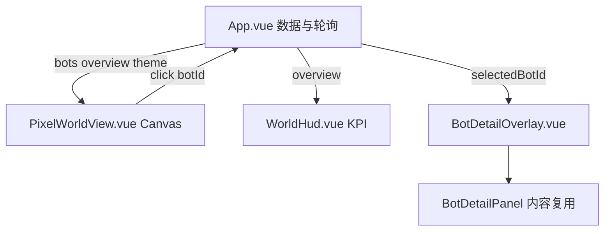

# 像素风管理台前端改造

> 实施计划归档。参考 [Reverie Demo](https://reverie.herokuapp.com/arXiv_Demo/)。  
> 范围：仅 [`admin/web/`](../../admin/web/)，不改 Rust API。

## 目标与约束

- **参考**：[Reverie Demo](https://reverie.herokuapp.com/arXiv_Demo/) — 俯视角地图 + 可点击角色 + 侧边状态详情。
- **范围**：仅 `admin/web/`，不改 Rust API。
- **交互**：地图常驻；点击 Bot 精灵 → **右侧浮层**展示现有启停 / QR / 转发策略 / 会话时间线（复用 `BotDetailPanel.vue` 逻辑）。
- **素材**：首版用 **Canvas 2D 程序化绘制**（色块房间 + 简笔小人 + 状态气泡），预留 `src/assets/pixel/` 目录便于后续替换精灵图。
- **主题**：沿用 `ThemeMode = "dark" | "light"` 与 `localStorage.admin_theme`，UI 文案改为 **白天 / 黑夜**（`ui.ts`），配色走像素专用变量，不再用当前 Arial + 圆角卡片风格。

## 现状要点

| 项 | 说明 |
|----|------|
| 框架 | Vue 3 + Vite，无 router/Pinia |
| 数据 | `App.vue` 轮询 `overview` / `bots`（3s 详情），逻辑保持不变 |
| Bot 状态 | `online` / `offline` / `pending_qr` / `expired`；运行时可能返回 `PendingQr` 等 PascalCase — 需统一 normalize |
| 无位置字段 | 房间坐标由前端按 `bots[]` 顺序分配 |

## 架构



**布局调整**（`admin/web/src/App.vue`）：

- 移除 `middleMode: "overview" | "detail"` 整页切换。
- 中间主区始终为 `PixelWorldView` + `WorldHud`；`selectedBotId` 非空时显示 `BotDetailOverlay`（右侧 `position: fixed` 或 grid 第二列，宽 ~380px，可关闭）。
- `BotDetailPanel.vue` 保留为子组件，由 Overlay 包裹像素边框样式；删除「返回概览」对 `middleMode` 的依赖，改为 `emit('close')` 清空选中。

## 状态 → 像素表现

新建 `admin/web/src/pixel/botActivity.ts`：

```ts
// normalizeStatus("PendingQr") → "pending_qr"
export type BotActivity =
  | "working"      // online，在书桌前
  | "sleeping"     // offline / expired，床上 zzz
  | "waiting_qr"   // pending_qr 或 has_qr_url
  | "disconnected" // has_runtime === false
  | "alert";       // forward_failures_today > 0（叠加角标）
```

映射规则（详情轮询时合并 `BotListItem` + 可选 `BotDetail`）：

| 条件 | 活动 | 气泡 |
|------|------|------|
| `!has_runtime`（仅 detail 有） | disconnected | `?` |
| `pending_qr` / `PendingQr` | waiting_qr | 手机/QR 图标 |
| `online` | working | 可选：今日消息数 |
| `offline` / `expired` | sleeping | `zzz` |
| `forward_failures_today > 0` | 原活动 + alert | `!` 红标 |

## Canvas 世界渲染

新建模块（均无外部依赖）：

| 文件 | 职责 |
|------|------|
| `pixel/worldTheme.ts` | day/night 色板：草地、外墙、木地板、床、桌、夜窗灯光 |
| `pixel/worldLayout.ts` | 根据 `bots.length` 生成房间网格（如每行 3 间），返回 `{ botId, roomRect, doorRect }`；提供 `hitTest(x,y)` |
| `pixel/drawWorld.ts` | 绘制建筑外轮廓、走廊、各房间家具（床/桌/马桶简笔画） |
| `pixel/drawBot.ts` | 绘制 8x8 风格小人、活动姿态（坐/躺/举手）、头顶气泡（bot_id 前两字 + 图标） |
| `components/PixelWorldView.vue` | `<canvas>` + `ResizeObserver` + `requestAnimationFrame` 轻动画；点击命中后 `emit('select-bot', id)` |

**多 Bot**：房间网格向下扩展，canvas 外层 `overflow: auto`，保持可滚动。

## UI 壳层像素化

| 组件 | 改动 |
|------|------|
| `TopBar.vue` | 像素字体、方形按钮、主题按钮改「白天/黑夜」 |
| `WorldHud.vue` | 替代 `OverviewBotsPanel.vue` 的 KPI 表格；地图左上角 4 格 chip + 「创建 Bot」 |
| `BotDetailOverlay.vue` | 半透明暗幕 + 像素面板；内嵌 `BotDetailPanel` |
| `BottomLogsPanel.vue` | 等宽字体、硬边框 |
| `App.vue` | 全局 CSS 变量改为像素主题 |

**删除**：`OverviewBotsPanel.vue`（功能由 Hud + 地图承担）。

## 数据流（不变部分）

- 保留 `App.vue` 内所有 `fetch*`、定时器、`selectBot` / `createBotNow` / 启停删逻辑。
- `selectBot(botId)`：设置 `selectedBotId`，拉 detail/policy，**不再** `middleMode = 'detail'`。
- 浮层打开时继续 3s `fetchBotDetail` 刷新；地图上精灵随 `bots` 列表同步。

## 测试

更新 `admin/web/tests/e2e/admin.spec.ts`：

- `data-testid="pixel-world"` / `data-testid="bot-sprite-{bot_id}"` 替代表格行选择。
- 断言点击精灵后 overlay 出现 bot 文案。

验证：`cd admin/web && npm run build`，再 `bash tools/scripts/test/run_e2e.sh`。

## 实施任务

| ID | 内容 | 状态 |
|----|------|------|
| pixel-core | 新增 pixel/ 模块：botActivity、worldTheme、worldLayout、drawWorld、drawBot | 待办 |
| world-view | 实现 PixelWorldView.vue（Canvas、命中检测、动画、testid） | 待办 |
| hud-overlay | 实现 WorldHud.vue + BotDetailOverlay.vue，改造 App.vue | 待办 |
| pixel-chrome | 像素化 TopBar / BotDetailPanel / BottomLogsPanel + ui.ts 白天黑夜文案 | 待办 |
| e2e-build | 更新 Playwright E2E；build + run_e2e.sh 验证 | 待办 |

## 文件清单

**新增**

- `admin/web/src/pixel/botActivity.ts`
- `admin/web/src/pixel/worldTheme.ts`
- `admin/web/src/pixel/worldLayout.ts`
- `admin/web/src/pixel/drawWorld.ts`
- `admin/web/src/pixel/drawBot.ts`
- `admin/web/src/components/PixelWorldView.vue`
- `admin/web/src/components/WorldHud.vue`
- `admin/web/src/components/BotDetailOverlay.vue`

**修改**

- `admin/web/src/App.vue`
- `admin/web/src/ui.ts`
- `admin/web/src/components/TopBar.vue`
- `admin/web/src/components/BotDetailPanel.vue`
- `admin/web/src/components/BottomLogsPanel.vue`
- `admin/web/tests/e2e/admin.spec.ts`

**删除**

- `admin/web/src/components/OverviewBotsPanel.vue`

## 后续可扩展（本次不做）

- 替换 `src/assets/pixel/` 真实 tileset 与 walk 动画
- 从 worker 日志解析「正在转发」临时态（需启发式，非结构化 API）
- 地图缩放/拖拽（Bot 数量很大时）
