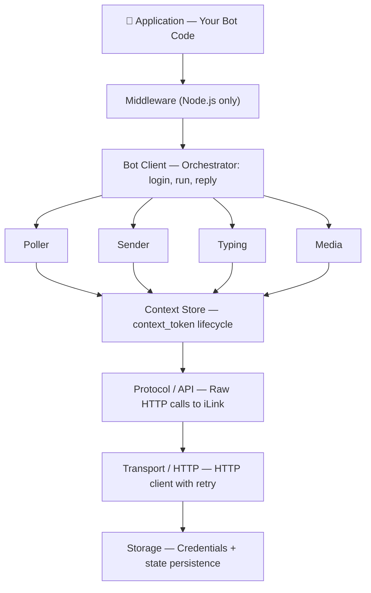

# Architecture

All four SDKs (Node.js, Python, Go, Rust) follow the same layered architecture and expose a consistent API surface.

## Layers



## SDK Comparison

| Feature | Node.js | Python | Go | Rust |
|---|---|---|---|---|
| Package | `@wechatbot/wechatbot` | `wechatbot-sdk` (PyPI) | `github.com/corespeed-io/wechatbot/golang` | `wechatbot` (crates.io) |
| Async model | `async/await` (Promises) | `async/await` (asyncio) | goroutines + `context.Context` | `async/await` (tokio) |
| Middleware | ✓ Express-style pipeline | — (use decorator composition) | — (use handler composition) | — (use closures) |
| Storage | Pluggable (file/memory/custom) | File-based | File-based | File-based |
| Media crypto | ✓ AES-128-ECB | ✓ AES-128-ECB | ✓ AES-128-ECB | ✓ AES-128-ECB |
| Events | Typed EventEmitter | Callbacks (on_qr_url, on_error…) | Callbacks (OnError, OnQRURL) | Callbacks |
| Error types | 6 typed error classes | Error hierarchy | APIError with methods | thiserror enum |
| Dependencies | 0 runtime | aiohttp, cryptography | stdlib only | reqwest, serde, aes, tokio |

## Shared Concepts

### context_token
Every reply must include the `context_token` from the incoming message. All SDKs:
1. Cache tokens in memory per `(userId)`
2. Auto-extract from incoming messages
3. Auto-inject into outgoing messages via `reply()`
4. (Node.js) Persist to storage for restart survival

### QR Login Flow
All SDKs implement the same flow:
1. `GET /get_bot_qrcode` → get QR URL
2. Display QR to user
3. `GET /get_qrcode_status` poll loop (2s interval)
4. On `confirmed` → extract credentials, persist to `~/.wechatbot/`
5. On `expired` → request new QR

### Long-Poll Loop
1. `POST /getupdates` with cursor (35s server hold)
2. Parse messages, cache context_tokens
3. Dispatch to handlers
4. On `-14` error → clear state, re-login
5. On network error → exponential backoff (1s → 10s max)

### Media Pipeline
All SDKs support encrypted media upload and download via the WeChat CDN:
1. **Upload**: generate AES key → encrypt (AES-128-ECB) → getuploadurl → POST to CDN → get download param
2. **Download**: GET from CDN → decrypt (AES-128-ECB) with key from message

The Node.js SDK additionally provides:
- **Unified `reply(msg, content)` / `send(userId, content)`** — one method handles text, image, video, file, and URL
- **Auto-routing by MIME** — `{ file: data, fileName: 'photo.png' }` routes as image; `.mp4` as video; others as file attachment
- **Remote URL support** — `{ url: 'https://...' }` auto-downloads and sends
- **Voice transcode** — SILK → WAV via optional `silk-wasm` dependency
- **Markdown stripping** — `stripMarkdown()` for cleaning AI model output before sending to WeChat

### Text Chunking
All SDKs split text at 2000 characters:
- Priority: paragraph break (`\n\n`) → line break (`\n`) → space → hard cut
- Each chunk gets a unique `client_id`
- All chunks share the same `context_token`

## File Structure

### Node.js
```
nodejs/
├── src/
│   ├── core/               # Client (unified reply/send/download), events, errors
│   ├── transport/          # HTTP with retry
│   ├── protocol/           # Wire types + API calls
│   ├── auth/               # QR login
│   ├── messaging/          # Poller, sender, typing, context
│   ├── media/              # AES crypto, CDN up/down, MIME, voice transcode,
│   │                       #   remote URL download, markdown stripping
│   ├── middleware/          # Engine + 4 builtins
│   ├── message/            # Parser, builder, types
│   ├── storage/            # File, memory, interface
│   └── logger/             # Structured logging
├── tests/                  # 69 unit tests
└── examples/               # 3 example bots
```

### Python
```
python/
├── wechatbot/
│   ├── __init__.py         # Public exports
│   ├── client.py           # WeChatBot (login, start, reply, send)
│   ├── protocol.py         # Raw iLink API calls
│   ├── auth.py             # QR login + credential persistence
│   ├── types.py            # All types (dataclasses)
│   ├── errors.py           # Error hierarchy
│   └── crypto.py           # AES-128-ECB encrypt/decrypt
├── examples/
│   └── echo_bot.py
└── tests/
    ├── test_crypto.py      # 10 tests
    └── test_client.py      # 8 tests
```

### Go
```
golang/
├── types.go                # All public types
├── bot.go                  # Bot client
├── internal/
│   ├── protocol/api.go     # iLink HTTP calls
│   ├── auth/login.go       # QR login + credentials
│   └── crypto/aes.go       # AES-128-ECB
└── examples/
    └── echo-bot/main.go
```

### Rust
```
rust/
├── src/
│   ├── lib.rs              # Re-exports
│   ├── types.rs            # All types (serde)
│   ├── error.rs            # Error hierarchy
│   ├── protocol.rs         # iLink API calls
│   ├── crypto.rs           # AES-128-ECB + tests
│   └── bot.rs              # Bot client
└── examples/
    └── echo_bot.rs
```
