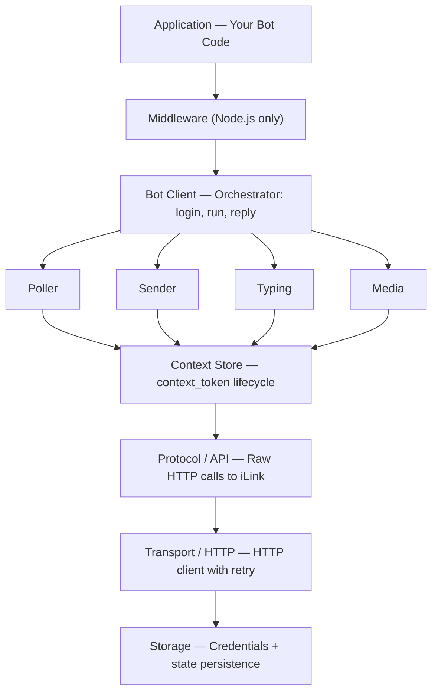
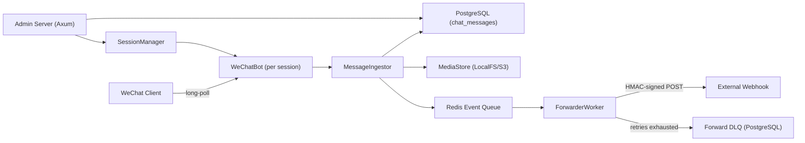

# Architecture

WeChatBot is a **multi-language SDK** for building WeChat bots using the **WeChat iLink Bot API** — an official Tencent interface for programmatic WeChat messaging. Its goal is to connect any AI agent or application to WeChat in minutes.

A companion **Pi Agent** extension bridges the [Pi coding assistant](https://github.com/badlogic/pi-mono) with WeChat, enabling AI-powered coding conversations directly from the WeChat app.

The **Rust SDK** goes beyond a client library to provide a **multi-bot server infrastructure** with PostgreSQL persistence, Redis event queuing, webhook forwarding with HMAC signing, and a web admin dashboard — supporting production-scale bot deployments.

---

## Technology Stack

| Layer | Technology |
|---|---|
| **Node.js SDK** | TypeScript 5.5+, Node.js >=22, Vitest, zero runtime deps |
| **Python SDK** | Python >=3.9, aiohttp 3.9+, cryptography 42+, pytest, Hatchling |
| **Go SDK** | Go 1.22, **pure stdlib** (no external dependencies) |
| **Rust SDK** | Rust 2021 edition, Tokio (async), Reqwest (HTTP), Serde (JSON), aes (AES-128), Axum (web), SQLx (Postgres), Redis-rs |
| **Rust Backend** | PostgreSQL 16, Redis 7, MinIO (S3-compatible storage), Docker Compose |
| **Pi Agent** | TypeScript/Node.js, `@wechatbot/wechatbot` SDK, qrcode-terminal |
| **CI/CD** | GitHub Actions |

---

## Project Structure

```
wechatbot/
├── README.md
├── README.EN.MD
├── trouble_shot.md
├── install.sh                 # Unix/macOS one-line installer
├── install.ps1                # Windows one-line installer (PowerShell)
│
├── docs/                      # Shared documentation
│   ├── protocol.md            # iLink Bot API protocol reference
│   └── architecture.md        # This file
│
├── nodejs/                    # Node.js SDK — @wechatbot/wechatbot
│   ├── package.json
│   ├── src/
│   │   ├── index.ts           # Public API re-exports
│   │   ├── core/              # WeChatBot client, TypedEventEmitter, errors
│   │   ├── transport/         # HTTP client with retry logic
│   │   ├── protocol/          # Wire types (CDNMedia, WireMessage), ILinkApi
│   │   ├── auth/              # QR login, credential management
│   │   ├── messaging/         # Poller, Sender, Typing, Context store
│   │   ├── media/             # AES crypto, CDN up/down, MIME, voice, URLs, markdown
│   │   ├── middleware/         # Express-style middleware engine + builtins
│   │   ├── message/           # Message parser, builder (chainable API), types
│   │   ├── storage/           # Pluggable storage: File, Memory, interface
│   │   └── logger/            # Structured logging with pluggable transports
│   ├── tests/                 # 69 unit tests (vitest)
│   └── examples/
│
├── python/                    # Python SDK — wechatbot-sdk
│   ├── pyproject.toml
│   ├── wechatbot/
│   │   ├── __init__.py        # Public exports
│   │   ├── client.py          # WeChatBot (login, start, reply, send, download, upload)
│   │   ├── protocol.py        # Raw iLink API calls
│   │   ├── auth.py            # QR login + credential persistence
│   │   ├── types.py           # All types as dataclasses + IntEnums
│   │   ├── errors.py          # Error hierarchy
│   │   └── crypto.py          # AES-128-ECB encrypt/decrypt
│   ├── examples/
│   └── tests/
│
├── golang/                    # Go SDK — stdlib only
│   ├── go.mod
│   ├── types.go               # All public types
│   ├── bot.go                 # Bot client (Login, Run, Reply, Send, Download, Upload)
│   ├── internal/
│   │   ├── protocol/api.go    # iLink HTTP client
│   │   ├── auth/login.go      # QR login + credential management
│   │   └── crypto/aes.go      # AES-128-ECB
│   └── examples/
│
├── rust/                      # Rust SDK + Multi-Bot Server
│   ├── Cargo.toml
│   ├── config/app.toml        # Default app configuration
│   ├── .env.example
│   ├── migrations/001_init.sql  # DB schema (sessions, messages, media, events, DLQ)
│   ├── docker-compose.dev.yml
│   ├── docker-compose.test.yml
│   ├── src/
│   │   ├── lib.rs             # Crate root: re-exports public API
│   │   ├── bot.rs             # WeChatBot client
│   │   ├── types.rs           # Serde types (WireMessage, CDNMedia, etc.)
│   │   ├── error.rs           # thiserror Error enum
│   │   ├── protocol.rs        # ILinkClient: raw HTTP calls
│   │   ├── crypto.rs          # AES-128-ECB, key generation
│   │   ├── config.rs          # AppConfig (TOML + env override)
│   │   ├── session.rs         # BotSessionManager: lifecycle management
│   │   ├── runtime.rs         # MultiBotRuntime: orchestrates sessions + services
│   │   ├── ingest.rs          # MessageIngestor: normalize → EventEnvelope → store + queue
│   │   ├── forwarder.rs       # ForwarderWorker: consume queue, HMAC-sign, forward with retry
│   │   ├── queue.rs           # EventQueue trait + InMemory + Redis implementations
│   │   ├── storage/
│   │   │   ├── mod.rs         # ChatRepository & SessionStateRepository traits
│   │   │   ├── postgres.rs    # PostgresChatRepository
│   │   │   ├── redis_state.rs # RedisSessionStateRepository
│   │   │   └── media.rs       # MediaStore trait + LocalFs + S3 implementations
│   │   ├── admin/
│   │   │   ├── mod.rs
│   │   │   ├── server.rs      # Axum web server
│   │   │   ├── state.rs       # AdminState (shared app state)
│   │   │   ├── repository.rs  # Postgres read queries for dashboard
│   │   │   ├── ui.rs          # Askama template rendering
│   │   │   ├── qr.rs          # QR URL store
│   │   │   └── handlers/      # Dashboard, bot list/detail/create/start/stop, healthz
│   │   └── bin/admin.rs       # Admin server binary entry point
│   ├── examples/
│   ├── templates/admin/       # Askama HTML templates
│   ├── static/admin/          # CSS
│   └── tests/
│
├── pi-agent/                  # Pi Extension — @wechatbot/pi-agent
│   ├── package.json
│   ├── src/
│   │   ├── index.ts           # Extension: /wechat command, QR login, bidirectional bridge
│   │   └── qrcode-terminal.d.ts
│   └── tsconfig.json
│
└── .github/workflows/         # CI/CD
```

---

## Layered Architecture

All four SDKs (Node.js, Python, Go, Rust) follow the same layered architecture:



### Module Responsibilities

| Module | Responsibility |
|---|---|
| **Auth** | QR code login: fetch QR → poll status → extract `bot_token` → persist credentials |
| **Protocol** | Low-level iLink API HTTP client. Endpoints: `get_bot_qrcode`, `get_qrcode_status`, `getupdates` (35s long-poll), `sendmessage`, `getconfig`, `sendtyping`, `getuploadurl` |
| **Crypto** | AES-128-ECB encryption/decryption with PKCS7 padding. Handles 3 key formats (direct hex, base64(raw), base64(hex)). Used for CDN media upload/download |
| **Bot Client** | Main orchestrator: manages credentials, context tokens, message handlers, long-poll loop, exponential backoff, session expiry recovery |
| **Messaging** | Poller (long-poll with cursor), Sender (chunk text, build messages), Typing indicator, Context token store (in-memory cache per userId) |
| **Media** | Upload (AES encrypt → getuploadurl → POST to CDN → receive download param) and Download (GET from CDN → AES decrypt) |
| **Storage** | Credential persistence. Node.js: pluggable (file/memory/custom). Rust: PostgreSQL + Redis |

### Node.js-Only Modules

| Module | Description |
|---|---|
| **Middleware** | Express/Koa-style composable pipeline. 4 builtins: retry, logging, typing indicator, reply-timeout |
| **Message Builder** | Chainable API for constructing messages of any type |
| **Logger** | Structured logging with pluggable transports |
| **Voice** | SILK → WAV transcode via optional `silk-wasm` dependency |
| **Markdown** | Stripping for cleaning AI model output before sending to WeChat |

---

## SDK Comparison

| Feature | Node.js | Python | Go | Rust |
|---|---|---|---|---|
| Package | `@wechatbot/wechatbot` | `wechatbot-sdk` (PyPI) | `wechatbot` (Go module) | `wechatbot` (crates.io) |
| Async model | `async/await` (Promises) | `async/await` (asyncio) | goroutines + `context.Context` | `async/await` (tokio) |
| Middleware | Express-style pipeline | — | — | — |
| Storage | Pluggable (file/memory/custom) | File-based | File-based | PostgreSQL + Redis |
| Media crypto | AES-128-ECB | AES-128-ECB | AES-128-ECB | AES-128-ECB |
| Events | Typed EventEmitter | Callbacks | Callbacks | Callbacks |
| Error types | 6 typed error classes | Error hierarchy | APIError with methods | thiserror enum |
| Runtime deps | 0 | aiohttp, cryptography | stdlib only | reqwest, serde, aes, tokio, sqlx, redis-rs |
| Multi-bot server | — | — | — | Admin dashboard + webhook forwarding |

---

## Rust Multi-Bot Server Architecture

The Rust crate extends the client SDK with production-scale multi-bot infrastructure:



### Rust-Exclusive Modules

| Module | Description |
|---|---|
| **MultiBotRuntime** | Orchestrates multiple bot sessions. Registers bots, wires up message ingestors, starts/stops sessions with heartbeat monitoring |
| **MessageIngestor** | Normalizes raw messages into `EventEnvelope` structs. Saves to PostgreSQL, downloads and persists media, publishes events to queue |
| **ForwarderWorker** | Consumes event queue, HMAC-SHA256 signs events, forwards to external webhook endpoint with retry and DLQ (dead letter queue) |
| **SessionManager** | Manages bot session lifecycle with status tracking: `PendingQr`, `WaitingConfirm`, `Online`, `Expired`, `Offline` |
| **Admin Server** | Axum-based HTTP dashboard for managing bots (create, start/stop, view history, overview stats) |
| **MediaStore** | Trait with LocalFs and S3 (MinIO) implementations for media blob storage |

### Configuration (Rust Server)

Multi-level configuration system:

1. **TOML Config** (`config/app.toml`) — default values for all components
2. **Environment Variables** — `WECHATBOT_*` prefixed vars override any TOML setting
3. **Database Modes** — `local` / `container` / `remote` — each component selects its connection URL based on the active mode

```toml
[database]     # mode, local_url, container_url, remote_url
[redis]        # mode, local_url, container_url, remote_url
[media]        # backend (localfs/s3), local_root, bucket, endpoint
[forwarder]    # endpoint, hmac_secret, max_retries, timeout_ms
[admin]        # bind address
```

### Database Schema

| Table | Purpose |
|---|---|
| `bot_sessions` | Bot registration, credentials, status, metadata |
| `chat_messages` | Incoming and outgoing messages with full payload |
| `chat_media` | Media metadata: type, size, storage path, AES keys |
| `forward_events` | Outbound event queue for webhook delivery tracking |
| `forward_dlq` | Dead letter queue for permanently failed forwards |

---

## Entry Points

| Entry Point | Location | Description |
|---|---|---|
| **Node.js SDK** | `nodejs/src/index.ts` | `import { WeChatBot } from '@wechatbot/wechatbot'` |
| **Python SDK** | `python/wechatbot/__init__.py` | `from wechatbot import WeChatBot` |
| **Go SDK** | `golang/bot.go` | `import wechatbot "github.com/corespeed-io/wechatbot/golang"` |
| **Rust Library** | `rust/src/lib.rs` | `use wechatbot::{WeChatBot, BotOptions}` |
| **Rust Admin Binary** | `rust/src/bin/admin.rs` | `cargo run --bin admin` |
| **Pi Agent** | `pi-agent/src/index.ts` | `pi install npm:@wechatbot/pi-agent` |
| **Prebuilt Binary** | GitHub Releases | Download via `install.sh` / `install.ps1` |

---

## Core Data Flows

### QR Login Flow (all SDKs)

```
get_qr_code → display QR → poll_qr_status (2s loop) → confirmed → save credentials
```

### Long-Poll Message Loop

```
POST /getupdates (cursor, 35s hold)
    → parse WireMessages → remember context_token
    → dispatch to handlers → handlers call reply()/send()
    → POST /sendmessage
```

### Session Recovery

```
errcode=-14 → clear state → force re-login → resume polling
network error → exponential backoff (1s → max 10s)
```

### Media Pipeline

```
Upload: generate AES key → encrypt (AES-128-ECB) → getuploadurl → POST to CDN → get download param
Download: GET from CDN → decrypt (AES-128-ECB) with key from message
```

---

## Shared Concepts

### `context_token`

Every reply must include the `context_token` from the incoming message. All SDKs:
1. Cache tokens in memory per `(userId)`
2. Auto-extract from incoming messages
3. Auto-inject into outgoing messages via `reply()`
4. (Node.js) Persist to storage for restart survival

### Text Chunking

All SDKs split text at 2000 characters using natural boundaries:
- Priority: paragraph break (`\n\n`) → line break (`\n`) → space → hard cut
- 30% minimum threshold prevents awkward short splits
- Each chunk gets a unique `client_id`, shares the same `context_token`

### AES Key Formats

Three formats are supported across all SDKs:
| Format | Example | Source |
|---|---|---|
| base64(raw 16 bytes) | `ABEiM0RVZneImaq7zN3u/w==` | `CDNMedia.aes_key` (format A) |
| base64(hex string) | `MDAxMTIyMzM0NDU1NjY3Nzg4OTlhYWJiY2NkZGVlZmY=` | `CDNMedia.aes_key` (format B) |
| direct hex (32 chars) | `00112233445566778899aabbccddeeff` | `image_item.aeskey` |

### File Extension Routing

Media files are auto-categorized by extension:
- `.png`, `.jpg`, `.gif` → image
- `.mp4`, `.mov`, `.webm` → video
- Everything else → file attachment

---

## External Integrations

| Integration | Endpoint | Purpose |
|---|---|---|
| **iLink Bot API** | `ilinkai.weixin.qq.com` | Core protocol: QR login, messages, typing, upload URL |
| **WeChat CDN** | `novac2c.cdn.weixin.qq.com` | Encrypted media upload/download (AES-128-ECB) |
| **PostgreSQL 16** | Configurable | Bot sessions, messages, media, forward events, DLQ |
| **Redis 7** | Configurable | Event queue, session state (online flag, heartbeat) |
| **MinIO / S3** | Configurable | Media file blob storage (optional, alt to local filesystem) |
| **Pi Coding Agent** | Local | AI agent bridge: WeChat messages → Pi prompts → WeChat replies |
| **npm registry** | — | `@wechatbot/wechatbot`, `@wechatbot/pi-agent` |
| **PyPI** | — | `wechatbot-sdk` |
| **crates.io** | — | `wechatbot` |

---

## Design Patterns

| Pattern | Where Used |
|---|---|
| **Strategy** | Storage backends (File, Memory, Custom in Node.js; LocalFs, S3 in Rust) |
| **Observer** | Event emitters in Node.js (`TypedEmitter`); callbacks in Rust/Python/Go |
| **Chain of Responsibility** | Node.js middleware pipeline (Express-style `(ctx, next) => ...`) |
| **Repository** | Rust `ChatRepository` trait with PostgreSQL implementation |
| **Builder** | Node.js `MessageBuilder` chainable API |
| **Actor Model** | Rust ForwarderWorker: consumes queue independently |
| **Exponential Backoff** | Network error retry in long-poll loops across all SDKs |
