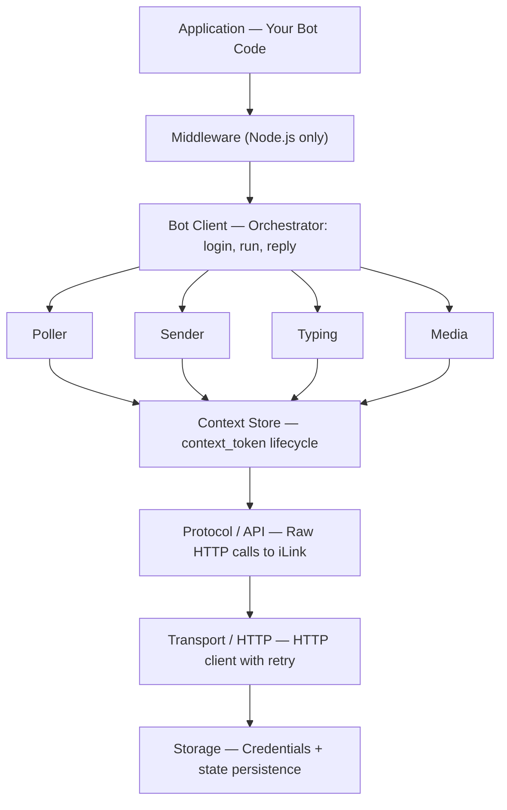
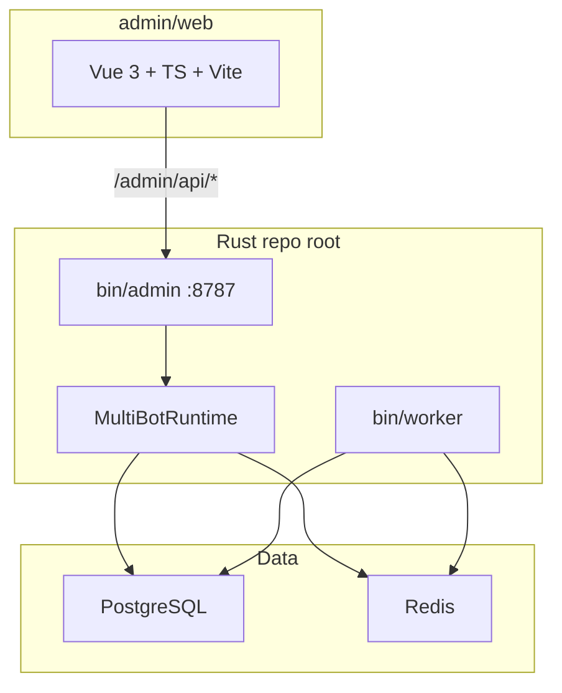
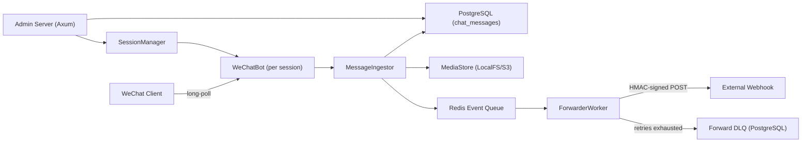

# Architecture

> 全仓架构对照（多语言）。Rust 运维细节见 [`rust/`](rust/README.md)；协议见 [`protocol.md`](protocol.md)。

WeChatBot is a **multi-language SDK** for building WeChat bots using the **WeChat iLink Bot API** — an official Tencent interface for programmatic WeChat messaging. Its goal is to connect any AI agent or application to WeChat in minutes.

A companion **Pi Agent** extension bridges the [Pi coding assistant](https://github.com/badlogic/pi-mono) with WeChat, enabling AI-powered coding conversations directly from the WeChat app.

The **Rust SDK** goes beyond a client library to provide a **multi-bot server infrastructure** with PostgreSQL persistence, Redis event queuing, webhook forwarding with HMAC signing, and a web admin dashboard — supporting production-scale bot deployments.

---

## Technology Stack

### Rust Main Engineering (repo root)

| Layer | Technology |
|---|---|
| **Language** | Rust 2021 edition |
| **Async runtime** | Tokio |
| **HTTP server** | Axum 0.8, Tower, tower-http |
| **Serialization** | serde / serde_json |
| **Logging** | tracing |
| **Config** | `config/app.toml` + `.env` (dotenvy) |
| **Data access** | **SQLx** (raw SQL + Repository pattern — **not** Diesel/SeaORM) |
| **Backend infra** | PostgreSQL 16, Redis 7, MinIO or localfs (Docker Compose in `deploy/`) |

### Admin Web Frontend (`admin/web/`)

| Layer | Technology |
|---|---|
| **Framework** | Vue 3 (Composition API, `<script setup>`) |
| **Language** | TypeScript |
| **Build** | Vite 7 |
| **Package runner** | Bun |
| **E2E** | Playwright |

No Vue Router or Pinia — view mode is toggled in `App.vue`; REST calls use native `fetch` via `src/api.ts`.

**Serving:** production builds to `admin/web/dist`, served by the `admin` binary at `/admin`. Dev: `bun run dev` on `:5174` with Vite proxy to `:8787` for `/admin/api`.

### Reference SDKs (separate packages)

| Layer | Technology |
|---|---|
| **Node.js SDK** | TypeScript 5.5+, Node.js >=22, Vitest, zero runtime deps |
| **Python SDK** | Python >=3.9, aiohttp 3.9+, cryptography 42+, pytest, Hatchling |
| **Go SDK** | Go 1.22, **pure stdlib** (no external dependencies) |
| **Pi Agent** (legacy) | TypeScript/Node.js, `@wechatbot/wechatbot` SDK |
| **CI/CD** | GitHub Actions |

Rust-specific architecture (binaries, routes, modules): [`rust/architecture.md`](rust/architecture.md).

---

## Project Structure

```
wechatbot/                     # Rust 主工程（仓库根）
├── Cargo.toml, src/, config/, migrations/, tests/, examples/
├── admin/web/                 # Vue 管理前端
├── deploy/                    # docker-compose（PG/Redis/MinIO）
├── tools/scripts/, tools/skill/
│
├── docs/                      # 文档
│   ├── protocol.md
│   ├── architecture.md        # This file
│   └── rust/                  # Rust 运维文档
│
├── reference-sdks/            # 参考语言实现
│   ├── nodejs/                # @wechatbot/wechatbot
│   ├── python/                # wechatbot-sdk
│   └── golang/                # Go module
│
├── legacy/                    # 附属/实验项目（非主工程）
│   ├── pi-agent/              # @wechatbot/pi-agent
│   ├── ai-app/                # 遗留 Python AI 应用
│   ├── devtools-bookmark/     # Chrome DevTools 扩展
│   └── webchat/               # 静态聊天 Demo
│
└── .github/workflows/
```

---

## Layered Architecture

All four SDKs (Node.js, Python, Go, Rust) follow the same layered architecture:


```mermaid
graph TD
    A["Application — Your Bot Code"] --> B["Middleware (Node.js only)"]
    B --> C["Bot Client — Orchestrator: login, run, reply"]
    C --> D["Poller"]
    C --> E["Sender"]
    C --> F["Typing"]
    C --> G["Media"]
    D --> H["Context Store — context_token lifecycle"]
    E --> H
    F --> H
    G --> H
    H --> I["Protocol / API — Raw HTTP calls to iLink"]
    I --> J["Transport / HTTP — HTTP client with retry"]
    J --> K["Storage — Credentials + state persistence"]
```

### Module Responsibilities

| Module | Responsibility |
|---|---|
| **Auth** | QR code login: fetch QR → poll status → extract `bot_token` → persist credentials |
| **Protocol** | Low-level iLink API HTTP client. Endpoints: `get_bot_qrcode`, `get_qrcode_status`, `getupdates` (35s long-poll), `sendmessage`, `getconfig`, `sendtyping`, `getuploadurl` |
| **Crypto** | AES-128-ECB encryption/decryption with PKCS7 padding. Handles 3 key formats (direct hex, base64(raw), base64(hex)). Used for CDN media upload/download |
| **Bot Client** | Main orchestrator: manages credentials, context tokens, message handlers, long-poll loop, exponential backoff, session expiry recovery |
| **Messaging** | Poller (long-poll with cursor), Sender (chunk text, build messages), Typing indicator, Context token store (in-memory cache per userId) |
| **Media** | Upload (AES encrypt → getuploadurl → POST to CDN → receive download param) and Download (GET from CDN → AES decrypt) |
| **Storage** | Credential persistence. Node.js: pluggable (file/memory/custom). Rust: PostgreSQL + Redis |

### Node.js-Only Modules

| Module | Description |
|---|---|
| **Middleware** | Express/Koa-style composable pipeline. 4 builtins: retry, logging, typing indicator, reply-timeout |
| **Message Builder** | Chainable API for constructing messages of any type |
| **Logger** | Structured logging with pluggable transports |
| **Voice** | SILK → WAV transcode via optional `silk-wasm` dependency |
| **Markdown** | Stripping for cleaning AI model output before sending to WeChat |

---

## SDK Comparison

| Feature | Node.js | Python | Go | Rust |
|---|---|---|---|---|
| Package | `@wechatbot/wechatbot` | `wechatbot-sdk` (PyPI) | `wechatbot` (Go module) | `wechatbot` (crates.io) |
| Async model | `async/await` (Promises) | `async/await` (asyncio) | goroutines + `context.Context` | `async/await` (tokio) |
| Middleware | Express-style pipeline | — | — | — |
| Storage | Pluggable (file/memory/custom) | File-based | File-based | PostgreSQL + Redis |
| Media crypto | AES-128-ECB | AES-128-ECB | AES-128-ECB | AES-128-ECB |
| Events | Typed EventEmitter | Callbacks | Callbacks | Callbacks |
| Error types | 6 typed error classes | Error hierarchy | APIError with methods | thiserror enum |
| Runtime deps | 0 | aiohttp, cryptography | stdlib only | reqwest, serde, aes, tokio, sqlx, redis-rs |
| Multi-bot server | — | — | — | Admin dashboard + webhook forwarding |

---

## Rust Multi-Bot Server Architecture

The Rust crate at the **repository root** extends the client SDK with production-scale multi-bot infrastructure. Two binaries:

| Binary | Entry | Role |
|---|---|---|
| **`admin`** | `src/bin/admin.rs` | Axum HTTP on `:8787` — REST API, Vue SPA (`admin/web/dist`), public QR register page; embeds `MultiBotRuntime` for start/stop |
| **`worker`** | `src/bin/worker.rs` | Standalone `ForwarderWorker` consuming Redis event queue |


```mermaid
flowchart TB
  subgraph fe ["admin/web"]
    Vue["Vue 3 + TS + Vite"]
  end
  subgraph be ["Rust repo root"]
    Admin["bin/admin :8787"]
    Worker["bin/worker"]
    RT["MultiBotRuntime"]
  end
  subgraph store ["Data"]
    PG["PostgreSQL"]
    RD["Redis"]
  end
  Vue -->|"/admin/api/*"| Admin
  Admin --> RT
  RT --> PG
  RT --> RD
  Worker --> RD
  Worker --> PG
```


```mermaid
graph LR
    A["WeChat Client"] -->|long-poll| B["WeChatBot (per session)"]
    B --> C["MessageIngestor"]
    C --> D["PostgreSQL (chat_messages)"]
    C --> E["MediaStore (LocalFS/S3)"]
    C --> F["Redis Event Queue"]
    F --> G["ForwarderWorker"]
    G -->|HMAC-signed POST| H["External Webhook"]
    G -->|retries exhausted| I["Forward DLQ (PostgreSQL)"]
    J["Admin Server (Axum)"] --> D
    J --> K["SessionManager"]
    K --> B
```

### Admin HTTP Routes

| Path | Purpose |
|---|---|
| `/admin` | Vue SPA shell + client routes |
| `/admin/api/overview` | Dashboard metrics |
| `/admin/api/bots` | List / create bots |
| `/admin/api/bots/{id}` | Detail / delete |
| `/admin/api/bots/{id}/start` \| `stop` \| `status` | Bot lifecycle |
| `/admin/api/bots/{id}/forward-policy` | Forwarding policy |
| `/admin/api/sessions/{id}/history` | Paginated message history |
| `/admin/api/system-logs/*` | Admin / worker log tail |
| `/bot/{bot_id}` | Public QR registration page |
| `/healthz` | Health check |

Auth: `Authorization: Bearer <token>` (hashed in `admin_users`).

### Rust-Exclusive Modules

| Module | Description |
|---|---|
| **MultiBotRuntime** | Orchestrates multiple bot sessions. Registers bots, wires up message ingestors, starts/stops sessions with heartbeat monitoring |
| **MessageIngestor** | Normalizes raw messages into `EventEnvelope` structs. Saves to PostgreSQL, downloads and persists media, publishes events to queue |
| **ForwarderWorker** | Consumes event queue, HMAC-SHA256 signs events, forwards to external webhook endpoint with retry and DLQ (dead letter queue) |
| **SessionManager** | Manages bot session lifecycle with status tracking: `PendingQr`, `WaitingConfirm`, `Online`, `Expired`, `Offline` |
| **Admin Server** | Axum-based HTTP dashboard for managing bots (create, start/stop, view history, overview stats) |
| **MediaStore** | Trait with LocalFs and S3 (MinIO) implementations for media blob storage |

### Configuration (Rust Server)

Multi-level configuration system:

1. **TOML Config** (`config/app.toml`) — default values for all components
2. **Environment Variables** — `WECHATBOT_*` prefixed vars override any TOML setting
3. **Database Modes** — `local` / `container` / `remote` — each component selects its connection URL based on the active mode

```toml
[database]     # mode, local_url, container_url, remote_url
[redis]        # mode, local_url, container_url, remote_url
[media]        # backend (localfs/s3), local_root, bucket, endpoint
[forwarder]    # endpoint, hmac_secret, max_retries, timeout_ms
[admin]        # bind address
```

### Database Schema

SQL migrations live in `migrations/*.sql`. Applied via `bash tools/scripts/db.sh migrate`.

| Table | Purpose |
|---|---|
| `bots` | Bot instances, status, heartbeat |
| `bot_sessions` | User sessions (wx user ↔ bot) |
| `chat_messages` | Incoming and outgoing messages with full payload (JSONB) |
| `chat_media` | Media metadata: type, size, storage path, AES keys |
| `forward_events` | Outbound event queue for webhook delivery tracking |
| `forward_dlq` | Dead letter queue for permanently failed forwards |
| `admin_users` / `admin_user_bot_scopes` | Admin RBAC |
| `bot_forward_policies` | Per-bot forwarding enable + target allowlist |

---

## Entry Points

| Entry Point | Location | Description |
|---|---|---|
| **Node.js SDK** | `reference-sdks/nodejs/src/index.ts` | `import { WeChatBot } from '@wechatbot/wechatbot'` |
| **Python SDK** | `reference-sdks/python/wechatbot/__init__.py` | `from wechatbot import WeChatBot` |
| **Go SDK** | `reference-sdks/golang/bot.go` | `import wechatbot "github.com/corespeed-io/wechatbot/golang"` |
| **Rust Library** | `src/lib.rs` | `use wechatbot::{WeChatBot, BotOptions}` |
| **Rust Admin Binary** | `src/bin/admin.rs` | `cargo run --bin admin` |
| **Pi Agent** | `legacy/pi-agent/src/index.ts` | `pi install npm:@wechatbot/pi-agent` |
| **Prebuilt Binary** | GitHub Releases | Download via `install.sh` / `install.ps1` |

---

## Core Data Flows

### QR Login Flow (all SDKs)

```
get_qr_code → display QR → poll_qr_status (2s loop) → confirmed → save credentials
```

### Long-Poll Message Loop

```
POST /getupdates (cursor, 35s hold)
    → parse WireMessages → remember context_token
    → dispatch to handlers → handlers call reply()/send()
    → POST /sendmessage
```

### Session Recovery

```
errcode=-14 → clear state → force re-login → resume polling
network error → exponential backoff (1s → max 10s)
```

### Media Pipeline

```
Upload: generate AES key → encrypt (AES-128-ECB) → getuploadurl → POST to CDN → get download param
Download: GET from CDN → decrypt (AES-128-ECB) with key from message
```

---

## Shared Concepts

### `context_token`

Every reply must include the `context_token` from the incoming message. All SDKs:
1. Cache tokens in memory per `(userId)`
2. Auto-extract from incoming messages
3. Auto-inject into outgoing messages via `reply()`
4. (Node.js) Persist to storage for restart survival

### Text Chunking

All SDKs split text at 2000 characters using natural boundaries:
- Priority: paragraph break (`\n\n`) → line break (`\n`) → space → hard cut
- 30% minimum threshold prevents awkward short splits
- Each chunk gets a unique `client_id`, shares the same `context_token`

### AES Key Formats

Three formats are supported across all SDKs:
| Format | Example | Source |
|---|---|---|
| base64(raw 16 bytes) | `ABEiM0RVZneImaq7zN3u/w==` | `CDNMedia.aes_key` (format A) |
| base64(hex string) | `MDAxMTIyMzM0NDU1NjY3Nzg4OTlhYWJiY2NkZGVlZmY=` | `CDNMedia.aes_key` (format B) |
| direct hex (32 chars) | `00112233445566778899aabbccddeeff` | `image_item.aeskey` |

### File Extension Routing

Media files are auto-categorized by extension:
- `.png`, `.jpg`, `.gif` → image
- `.mp4`, `.mov`, `.webm` → video
- Everything else → file attachment

---

## External Integrations

| Integration | Endpoint | Purpose |
|---|---|---|
| **iLink Bot API** | `ilinkai.weixin.qq.com` | Core protocol: QR login, messages, typing, upload URL |
| **WeChat CDN** | `novac2c.cdn.weixin.qq.com` | Encrypted media upload/download (AES-128-ECB) |
| **PostgreSQL 16** | Configurable | Bot sessions, messages, media, forward events, DLQ |
| **Redis 7** | Configurable | Event queue, session state (online flag, heartbeat) |
| **MinIO / S3** | Configurable | Media file blob storage (optional, alt to local filesystem) |
| **Pi Coding Agent** | Local | AI agent bridge: WeChat messages → Pi prompts → WeChat replies |
| **npm registry** | — | `@wechatbot/wechatbot`, `@wechatbot/pi-agent` |
| **PyPI** | — | `wechatbot-sdk` |
| **crates.io** | — | `wechatbot` |

---

## Design Patterns

| Pattern | Where Used |
|---|---|
| **Strategy** | Storage backends (File, Memory, Custom in Node.js; LocalFs, S3 in Rust) |
| **Observer** | Event emitters in Node.js (`TypedEmitter`); callbacks in Rust/Python/Go |
| **Chain of Responsibility** | Node.js middleware pipeline (Express-style `(ctx, next) => ...`) |
| **Repository** | Rust `ChatRepository` trait with PostgreSQL implementation |
| **Builder** | Node.js `MessageBuilder` chainable API |
| **Actor Model** | Rust ForwarderWorker: consumes queue independently |
| **Exponential Backoff** | Network error retry in long-poll loops across all SDKs |
