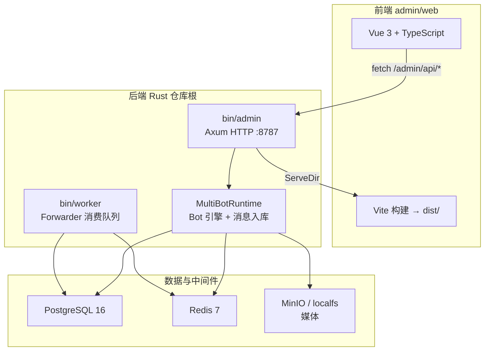

# Rust 多 Bot 架构

仓库根目录为 **Rust 主工程**：微信 iLink Bot SDK + 管理后台 API + 消息转发流水线。管理界面在 [`admin/web/`](../../admin/web/)，由 `admin` 二进制托管构建产物 `admin/web/dist`。

---

## 技术栈总览

### 后端（仓库根 `src/`）

| 层级 | 选型 |
|------|------|
| 语言 | **Rust 2021** |
| 异步运行时 | **Tokio** |
| HTTP 框架 | **Axum 0.8** + **Tower** / **tower-http** |
| 序列化 | **serde** / **serde_json** |
| 日志 | **tracing** |
| 配置 | `config/app.toml` + `.env`（**dotenvy**） |

### 数据访问（非传统 ORM）

项目使用 **[SQLx](https://github.com/launchbadge/sqlx)**，**不是** Diesel / SeaORM 等 ORM：

- 手写 SQL + `sqlx::query` / `query_as`
- Repository 模式：`PostgresChatRepository`（业务数据）、`AdminRepository`（管理查询）
- 迁移：纯 SQL 文件 [`migrations/`](../../migrations/)，由 `bash tools/scripts/db.sh migrate` 执行

### 数据与中间件

| 组件 | 版本/说明 | 用途 |
|------|-----------|------|
| **PostgreSQL** | 16（`deploy/docker-compose.dev.yml`） | Bot、会话、消息、转发、RBAC 持久化 |
| **Redis** | 7 | 事件队列（`wechatbot:events`）、会话在线/心跳 |
| **MinIO** | S3 兼容 | 媒体对象存储（可选；也可 `localfs`） |

连接串与模式切换见 [`configuration.md`](configuration.md)（`local` / `container` / `remote`）。

### 前端（`admin/web/`）

| 层级 | 选型 |
|------|------|
| 框架 | **Vue 3**（Composition API + `<script setup>`） |
| 语言 | **TypeScript** |
| 构建 | **Vite 7** |
| 包管理/运行 | **Bun**（`bun install` / `bun run build`） |
| E2E | **Playwright** |

**未使用** Vue Router、Pinia、UI 组件库——路由在 `App.vue` 内用 `overview | detail` 模式切换；API 用原生 `fetch`（`src/api.ts`）。

---

## 整体架构



### 访问方式

| 环境 | 前端 | API |
|------|------|-----|
| 集成/生产 | `http://127.0.0.1:8787/admin`（Axum 托管 `admin/web/dist`） | 同域 `/admin/api/*` |
| 本地开发 | `cd admin/web && bun run dev` → `:5174/admin` | Vite 代理 `/admin/api` → `:8787` |

Vite 代理配置见 [`admin/web/vite.config.ts`](../../admin/web/vite.config.ts)。

---

## 可执行文件

| 二进制 | 入口 | 职责 |
|--------|------|------|
| **`admin`** | `src/bin/admin.rs` | HTTP 服务（默认 `127.0.0.1:8787`）；REST API + Vue SPA + 公开注册页；内嵌 `MultiBotRuntime` 可启动/停止 Bot |
| **`worker`** | `src/bin/worker.rs` | 独立 Forwarder 进程，从 Redis 队列消费并转发 webhook/Coze 等 |

---

## HTTP 路由（`src/admin/server.rs`）

```
/                         → 重定向 /admin
/healthz                  → 健康检查
/admin/*                  → Vue SPA（history fallback）
/admin/api/overview       → 总览指标
/admin/api/bots           → Bot 列表 / 创建
/admin/api/bots/{id}      → 详情 / 删除
/admin/api/bots/{id}/start|stop|status
/admin/api/bots/{id}/forward-policy
/admin/api/sessions/{id}/history
/admin/api/system-logs/admin|worker
/bot/{bot_id}             → 公开扫码注册页
```

鉴权：`Authorization: Bearer <token>`，token 哈希存 `admin_users`（见 `src/admin/auth.rs`）。

---

## 模块边界

| 模块 | 职责 |
|------|------|
| `bot.rs` / `protocol.rs` | 微信 iLink 协议、登录、收发包 |
| `runtime.rs` | 多 Bot 运行时，串联 PG / Redis / 队列 / 媒体 |
| `ingest.rs` | 消息标准化与入库 |
| `forwarder.rs` | 转发、重试、DLQ |
| `admin/` | 管理 API、鉴权、Repository、QR 注册页 |
| `storage/` | Postgres / Redis / 媒体存储抽象 |
| `core` | 协议与核心类型（若拆分） |
| `infra` | 配置、日志 |

## 数据流

1. Bot 收到微信消息。
2. `MessageIngestor` 标准化为 `EventEnvelope`。
3. 文本/结构化消息写 `chat_messages`；媒体写介质存储 + `chat_media`。
4. 事件推送到 Redis 队列。
5. `ForwarderWorker` 读取、HMAC 签名并转发下游；失败重试 / DLQ。
6. 转发前按 `bot_forward_policies` 检查开关与 `allowed_targets`。
7. Admin 前端轮询 API 展示 Bot 列表、会话历史与转发时间线。

## 数据库表（PostgreSQL）

| 表 | 用途 |
|----|------|
| `bots` | Bot 实例、状态、心跳 |
| `bot_sessions` | 用户会话（wx 用户 ↔ bot） |
| `chat_messages` | 聊天消息（含 JSONB 原始 payload） |
| `chat_media` | 媒体元数据 |
| `forward_events` / `forward_dlq` | 转发状态与死信 |
| `admin_users` / `admin_user_bot_scopes` | RBAC |
| `bot_forward_policies` | 转发策略 |

Redis 键前缀示例：`wechatbot:session:{id}:online`、`wechatbot:events`（见 [`storage.md`](storage.md)）。

## 管理端权限模型

- `admin_users`：管理员身份与 token 哈希
- `admin_permissions`：角色到权限点映射
- `admin_user_bot_scopes`：用户可访问 bot 范围
- `bot_forward_policies`：Bot 级转发策略（可启停、目标白名单）

## 前端结构（`admin/web/src/`）

| 路径 | 职责 |
|------|------|
| `App.vue` | 主布局、状态、定时刷新（约 1s） |
| `api.ts` | `fetch` 封装，调用 `/admin/api/*` |
| `components/OverviewBotsPanel.vue` | Bot 列表与总览 |
| `components/BotDetailPanel.vue` | 详情、会话、消息时间线、转发策略 |
| `components/BottomLogsPanel.vue` | Admin / Worker 日志 |
| `botPresentation.ts` | 状态文案（在线 / 离线 / 待扫码 / 已过期） |

Token 默认存 `localStorage.admin_token`（开发默认 `dev-admin-token`）。

## 与参考 SDK 的关系

[`reference-sdks/`](../../reference-sdks/) 为 Node / Python / Go **参考实现**；[`legacy/`](../../legacy/) 为 Pi Agent 等归档项目。本仓库根的 Rust 工程才是 Admin + Worker + 完整运行时。

全仓多语言对照见 [`../architecture.md`](../architecture.md)。

## 启动模式

| 模式 | 命令 | 数据库 |
|------|------|--------|
| dev（测试/演示） | `bash tools/scripts/start.sh` | migrate + mock seed |
| deploy（部署） | `bash tools/scripts/start.sh --deploy` | 仅 migrate |

详见 [`deployment.md`](deployment.md)。
