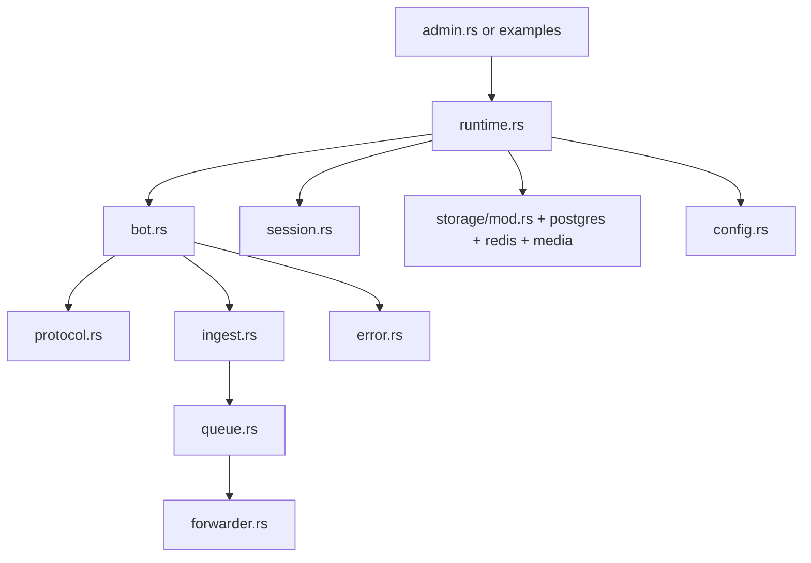

# Rust SDK 代码深度分析

本文件面向维护 `rust/` SDK 的开发者，聚焦可验证的模块职责与调用路径。

## 1. 入口与模块边界

### 1.1 Cargo 入口

- 二进制入口：`src/bin/admin.rs`（`Cargo.toml` 中 `[[bin]] name = "admin"`）
- 示例入口：`examples/echo_bot.rs`、`examples/multi_bot_runtime.rs`

### 1.2 库公开模块（`src/lib.rs`）

`lib.rs` 公开模块：

- `admin`
- `bot`
- `config`
- `crypto`
- `error`
- `forwarder`
- `ingest`
- `protocol`
- `queue`
- `runtime`
- `session`
- `storage`
- `types`

对应对外主能力：`WeChatBot`、`MultiBotRuntime`、`ForwarderWorker`、`AppConfig`、`WeChatBotError`。

## 2. 核心模块职责

### 2.1 `bot.rs`：单 Bot 生命周期

`WeChatBot` 封装登录、轮询、收发消息、媒体处理与凭据管理。

关键方法：

- `login(force)`：凭据复用 + 二维码登录
- `run()`：长轮询获取更新并执行 `on_message` 回调
- `reply/send/send_media/reply_media/send_typing`：发送侧 API

关键行为：

- `login(false)` 优先读取本地凭据（默认 `~/.wechatbot/credentials.json`）。
- `run()` 命中会话过期时调用 `login(true)` 重登并继续轮询。

### 2.2 `protocol.rs`：iLink API 适配层

`ILinkClient` 负责对接 iLink 协议：

- 获取二维码、轮询登录状态
- 拉取消息更新
- 发消息、typing、上传地址获取

该层统一处理 HTTP 异常和业务 `ret/errcode/errmsg` 异常。

### 2.3 `runtime.rs`：多 Bot 编排

`MultiBotRuntime` 是生产编排中心。

- `from_config(config)`：装配 Postgres、Redis、MediaStore、MessageIngestor、ForwarderWorker。
- `create_bot(bot_id, qr_callback)`：注册 bot、登录、建 session、绑定消息处理、启动 heartbeat。

### 2.4 `session.rs`：会话状态管理

`BotSessionManager` 维护 session 生命周期和状态切换，承担自动恢复与稳定性保障。

### 2.5 `ingest.rs` + `queue.rs`：摄取与事件化

- `MessageIngestor::ingest(...)`：落库消息、处理媒体、发布事件
- `MessageIngestor::ingest_sent(...)`：记录发送侧事件
- `EventQueue` trait：解耦入站和转发

### 2.6 `forwarder.rs`：可靠转发

`ForwarderWorker::run_forever()` 持续消费事件并转发 webhook，含失败重试与 DLQ 机制。

### 2.7 `storage/*`：存储实现

- `storage/mod.rs`：仓储抽象（会话、聊天、媒体）
- `storage/postgres.rs`：关系数据持久化
- `storage/redis_state.rs`：在线状态与心跳
- `storage/media.rs`：本地/S3 兼容媒体存储

### 2.8 `config.rs` 与 `error.rs`

- `config.rs`：配置加载与校验
- `error.rs`：统一错误模型，`is_session_expired()` 提供会话过期判定

## 3. 关键数据流

### 3.1 登录链路

1. `WeChatBot::login(force)`
2. `force=false` 时先尝试本地凭据
3. 凭据不可用则 `get_qr_code` + `poll_qr_status`
4. `confirmed` 后写入内存并保存本地凭据

### 3.2 消息接收链路

1. `run()` 调用 `get_updates`
2. 解析消息并分发 handlers
3. 在 `MultiBotRuntime` 中进入 `ingest -> 业务处理 -> ingest_sent`

### 3.3 会话过期恢复

1. API 异常映射到 `WeChatBotError::Api`
2. `is_session_expired()` 判定过期
3. 清理上下文与 cursor 后执行强制重登

### 3.4 转发可靠性链路

1. ingest 发布事件到队列
2. forwarder 消费并请求 webhook
3. 失败进入重试
4. 超过阈值写入 DLQ

## 4. 调用关系图

## 5. 推荐阅读顺序

1. `src/lib.rs`
2. `src/bot.rs`
3. `src/protocol.rs`
4. `src/runtime.rs`
5. `src/ingest.rs` 与 `src/forwarder.rs`
6. `src/session.rs`
7. `src/storage/*`
8. `src/config.rs` 与 `src/error.rs`

## 6. 扩展点与风险点

### 6.1 扩展点

- 新消息类型：扩展 `types.rs` 与解析路径
- 新媒体后端：实现 `MediaStore` 并接入 runtime
- 新队列后端：实现 `EventQueue` 并替换装配
- 新转发策略：扩展 `forwarder.rs` 签名/重试逻辑

### 6.2 风险点

- 会话过期处理不完整会导致轮询中断
- 心跳状态不同步会造成“假在线”
- 锁粒度过粗会压低吞吐
- 重试参数不合理会导致 DLQ 激增
